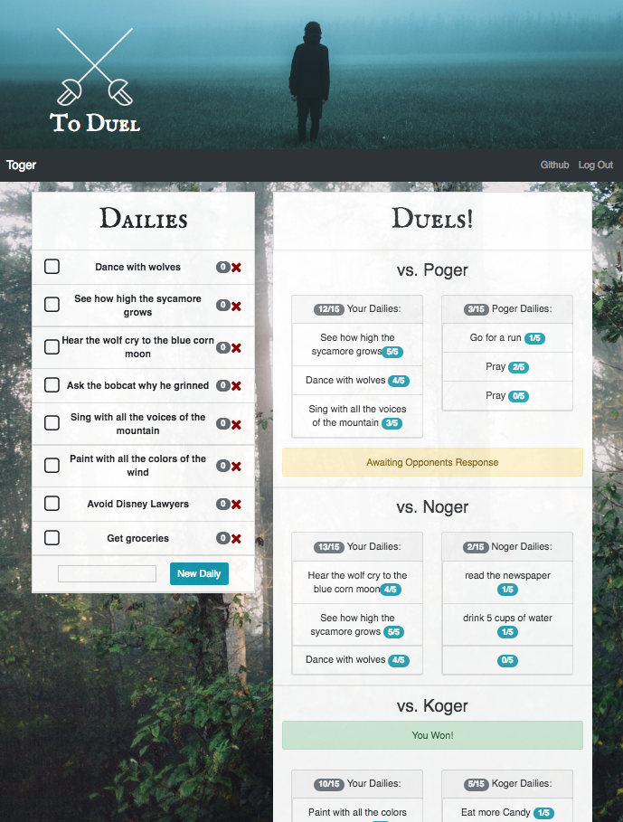

# To Duel (Frontend)

This is the frontend of the project.
The backend repo can be found at: https://github.com/gEightyTwo/to-duel-backend

To Duel is a full-stack to-do web application.  The app allows users to engage in multiple concurrent head-to-head challenges with other users to encourage better daily habits.


## Getting Started

These instructions will get you a copy of the project up and running on your local machine for development and testing purposes. See deployment for notes on how to deploy the project on a live system.


### Prerequisites

What things you need to install the software and how to install them

```shell
* fork and clone this repository
* run npm install
```


### Installing

Make sure the database and backend are created first!

Start the react development server:

```shell
* npm start
```


## Deployment

This project has been deployed on Heroku at the address:
https://to-duel.herokuapp.com/



## Built With

* [JavaScript](https://www.javascript.com/) - The language
* [Reactstrap](https://reactstrap.github.io/) - The CSS framework used
* [React](https://reactjs.org/) - Frontend library
* [Redux](https://redux.js.org/) - State container
* [PostgreSQL](https://www.postgresql.org/) - database
* [Axios](https://github.com/axios/axios) - Promise based HTTP client for the browser and Node.js
* [Node](https://nodejs.org/en/) - Package ecosystem


## Contributing

Please send either of the developers a message for details on our code of conduct, and the process for submitting pull requests to us.


## Authors

* **Bryan Kai** - *Initial work* - [bryankai](https://github.com/bryankai)
* **Dustin Ruskell** - *Initial work* - [Ventronik](https://github.com/Ventronik)
